# Building a chatbot with Watson Assistant and Watson Discovery
## Developing a conversation

In this module, we'll learn how to use [Watson Assistant](https://www.ibm.com/products/watson-assistant) to create a virtual agent (chatbot). IBM Watson Assistant (WA) helps overcome the steep learning curve required for building virtual agents. WA allows to design AI chatbots without complex decision trees and does not require coding.

Watson Assistant provides the capability to deliver fast, consistent and accurate answers across wide spectrum of media. Using AI, Watson Assistant learns from customer conversations, improving its ability to resolve issues the first time while removing the frustration of long wait times, tedious searches and unhelpful chatbots. 

This section is broken up into the following steps:

1. [Create a Watson Assistant](#create-a-watson-assistant)
2. [Create a Conversation](#create-a-conversation)
    * [intents](#intents)
    * [entities](#entities)
    * [a dialog](#dialog)
3. [Conclusion](#conclusion-of-the-module)

> **Note:** You can click on any image in the instructions below to zoom in and see more details. 
> When you do that just click on your browser's back button to return to the previous page.

## Create a Watson Assistant
An assistant helps your customers complete tasks and get information faster. It may clarify requests, search for answers from a knowledge base, and can also direct your customer to a human if needed.

1. Go the (☰) navigation menu, click on `Instances`.

    
    
2. To start Watson Assistant UI, click on the link with type `assistant` (e.g `User1-WA-Instance`) in the list of available instances and click on `Launch tool` in the opened page.

    [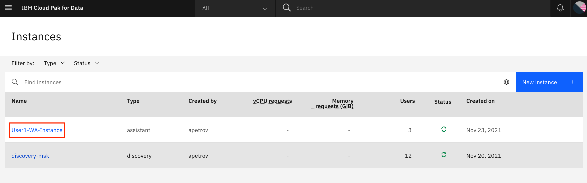](../images/assistant/assistant-instances.png)
    [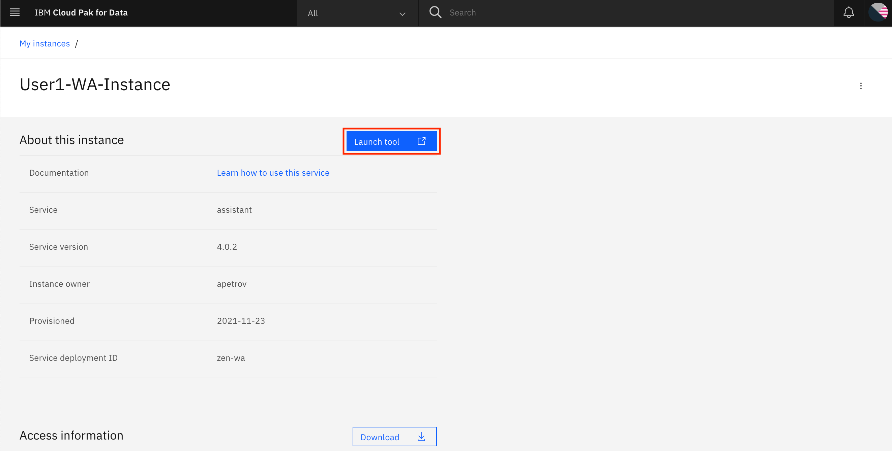](../images/assistant/assistant-launch-tool.png)
    
3. In the UI, please choose either `Create assistant` or choose an existing assistant if you created one previously. In case of creating a new assistant, specify the name, description.

    
    [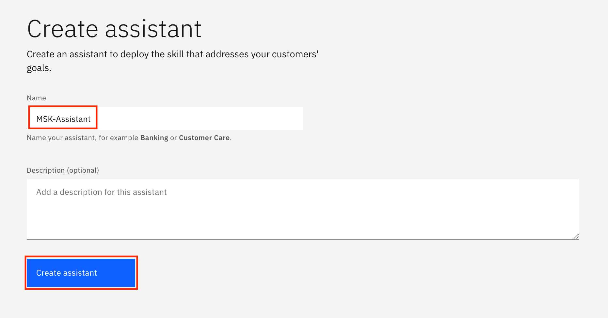](../images/assistant/assistant-create-with-details.png)
    [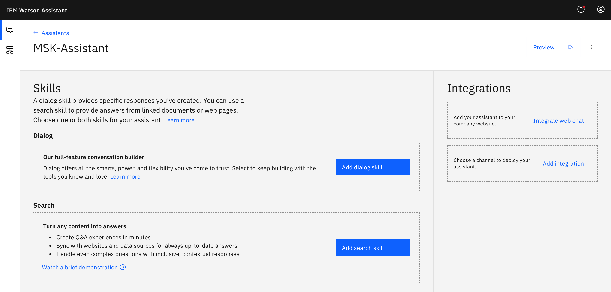](../images/assistant/assistant-created.png)

## Create a Conversation

In chatbot development, for creating dialogs/conversations Watson Assistant is using skills. Skills contain the training to respond to your customer queries. You need to create needed skills (e.g. a dialog skill) and add skills to your assistant before using your assistant. In this session, we will not develop the dialog skill step-by-step, 
but will rather use a prepared template to fit this work into a timeframe for this session.

1. Please navigate to the menu `Skills`.

    [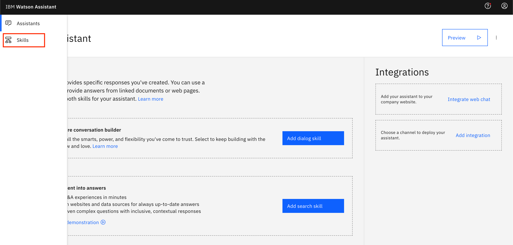](../images/assistant/assistant-skills.png)

2. Click on `Create Skill`.
[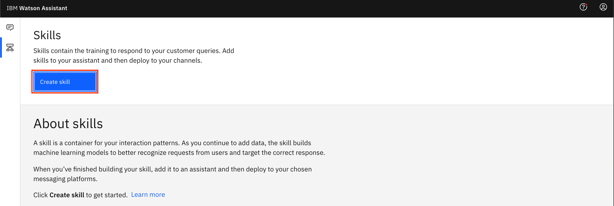](../images/assistant/assistant-create-skill.png)

    * The next step is to choose the `Dialog skill` and click `Next`. This is a conversation builder.

    [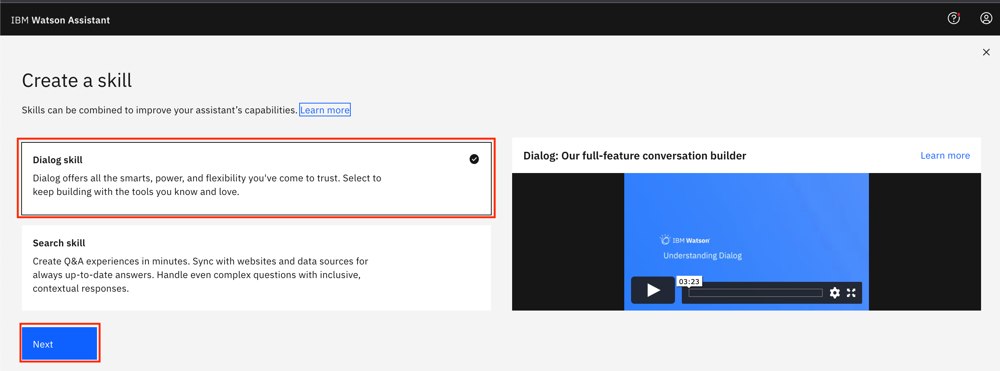](../images/assistant/assistant-create-dialog-skill.png)

3. Choose `Upload skill` and use the file `skill-Dialog-skill.json` which contains a template for this project. Please click `Upload`.

    [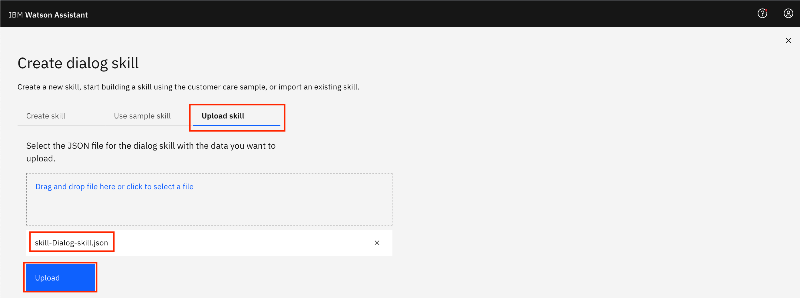](../images/assistant/assistant-dialog-skill-ui.png)
 
4. The imported skill contains a few predefined
    * intents:
        [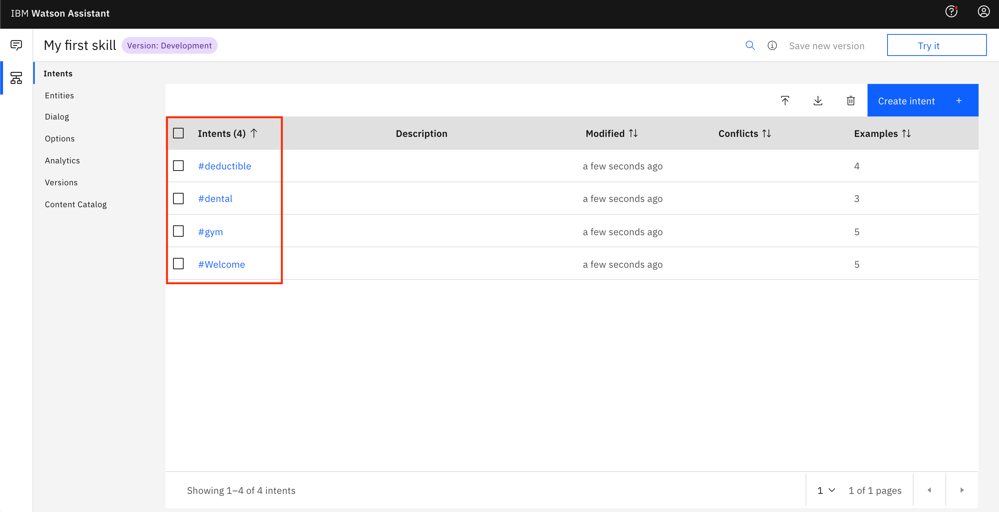](../images/assistant/assistant-intents.png)

        Here is a #deductible intent definition through several examples of corresponding utterances.
        
        Watson Assistant tunes a machine learning model for classifying the intents based on these examples. 

        [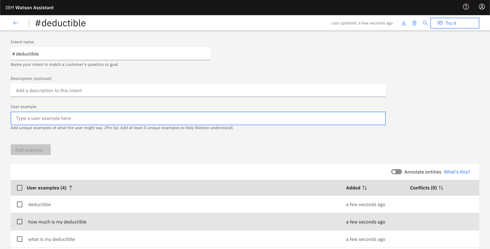](../images/assistant/assistant-intent.png)

    * entities: 
        [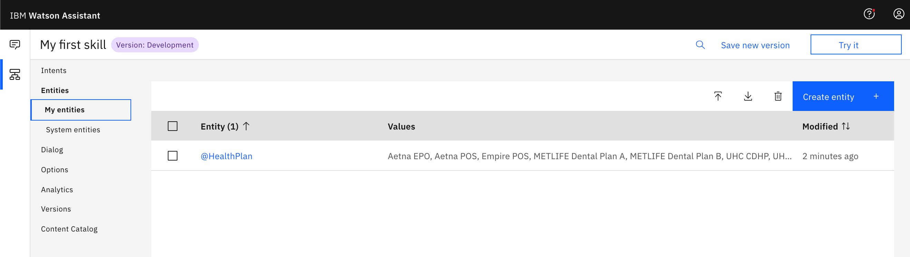](../images/assistant/assistant-entities.png)

    * a dialog:
        [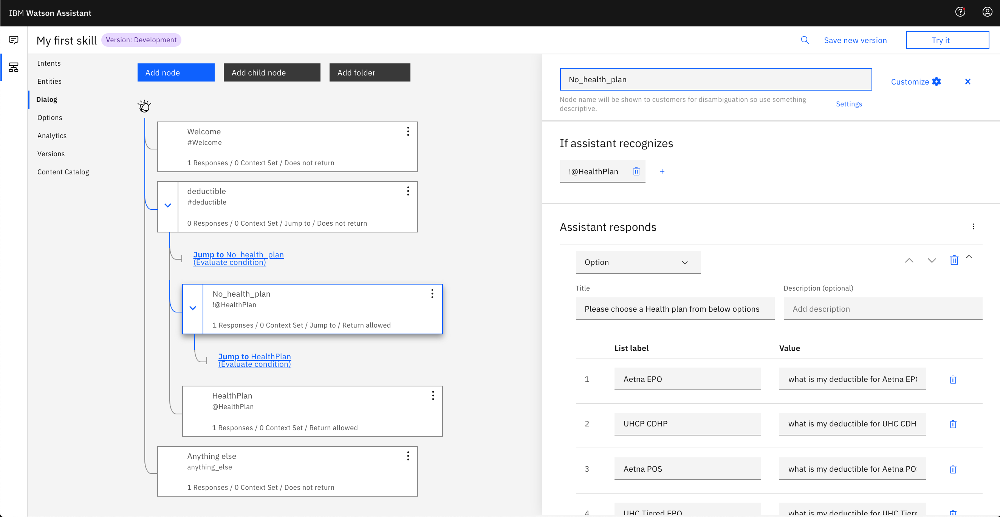](../images/assistant/assistant-dialog.png)

5. Please explore UI, the definitions of the intents, entities, and a dialog. Please add an intent and extend a dialog based on your choice (without using documentation). Please observe that the developed dialog is  prescriptive and requires functionality that is able to handle generic requests, which is provided as part of search skill.

## Conclusion of the module

By this moment, we developed a scripted dialog skill that can handle a narrow set of questions and situations. In this section we covered creating a scripted conversation including:

* Creating an assistant
* Creating a conversation (a dialog, intents, entities)

The next section covers extending the chatbot to support generic search functionality using Watson Discovery.
