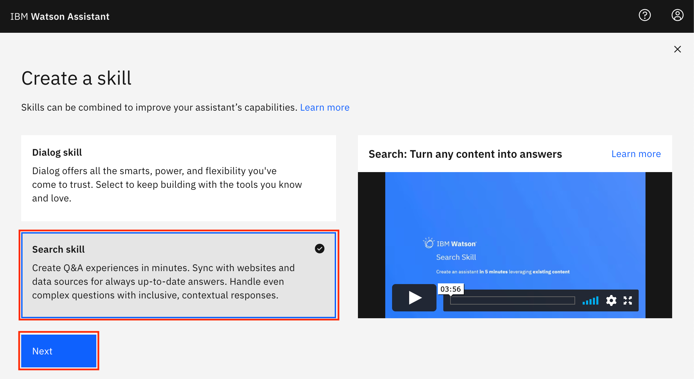
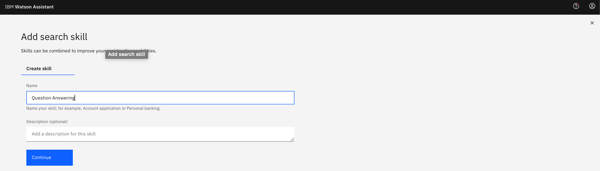
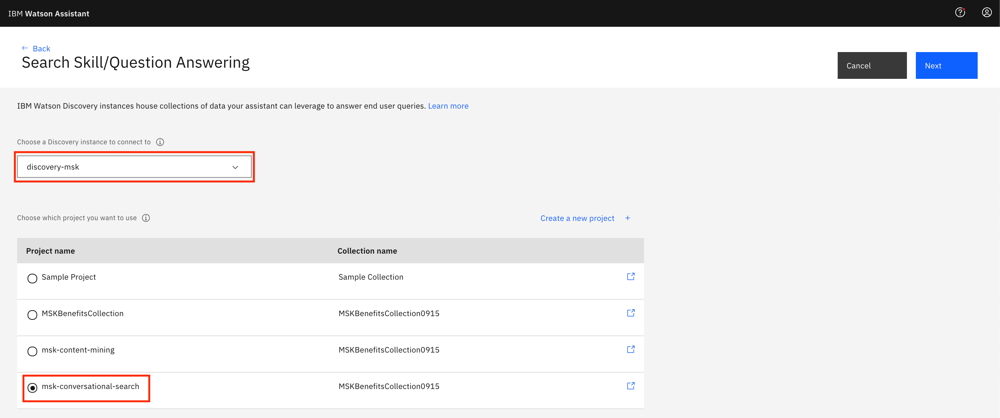
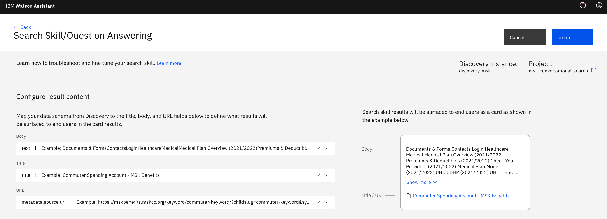
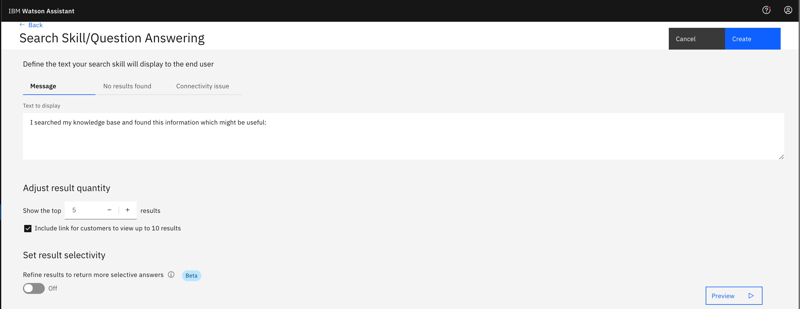
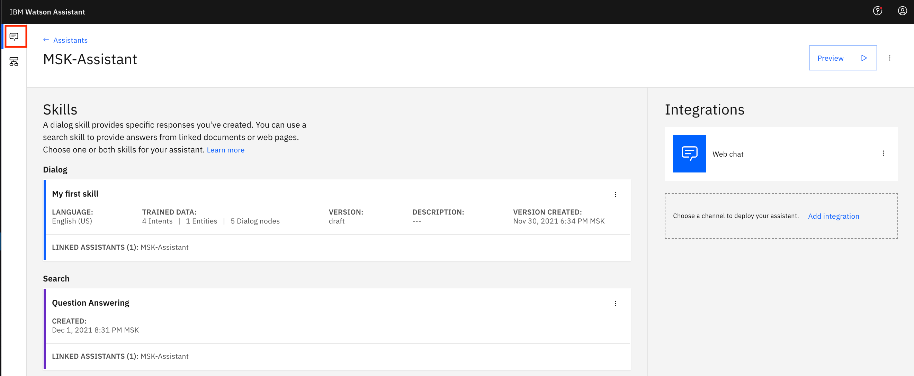
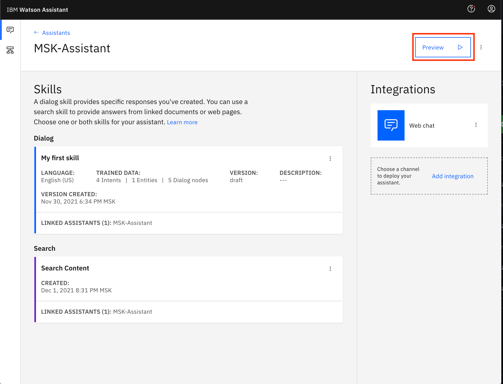
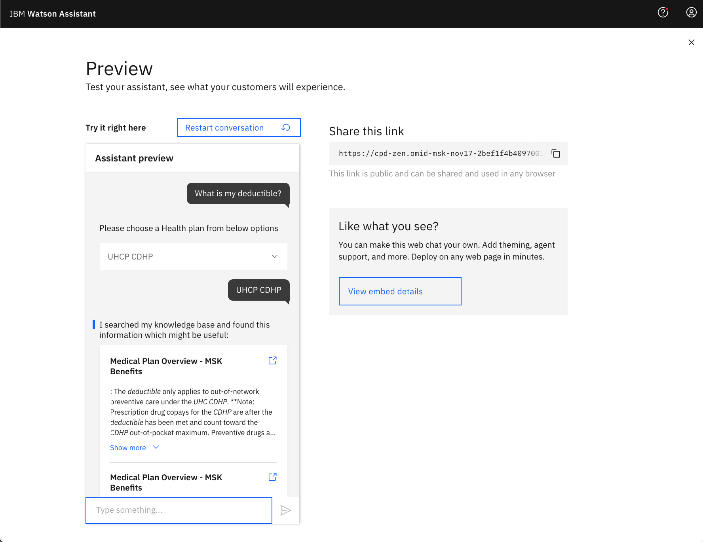

# Building a chatbot with Watson Assistant and Watson Discovery
## Search capabilities using Watson Discovery

In this module, we'll learn how to extend the asistant developed in the previous module to equip it with a search capability.

Watson Assistant provides the capability to deliver fast, consistent and accurate answers across wide spectrum of media. Using AI, Watson Assistant learns from customer conversations, improving its ability to resolve issues the first time while removing the frustration of long wait times, tedious searches and unhelpful chatbots. 

Search skill based on Watson Discovery allows to: 

* Create content search experiences in minutes
* Sync with websites and data sources for always up-to-date outcomes
* Handle even complex requests with inclusive, contextual responses

> **Note:** You can click on any image in the instructions below to zoom in and see more details. 
> When you do that just click on your browser's back button to return to the previous page.

## Create a Search Skill
This skill is based on Watson Discovery and requires connecting to a collection that indexes the content of MSK Benefits website.
Such a collection was prepared for your environment. 

1. Navigate to available `Skills` and click on `Create Skill` as outlined in the previous module.

    * The next step is to choose the `Search skill` and click `Next`. This leads to search skill builder.
       

2. Please name the skill and click continue.
   

3. At this phase, you need to choose the Watson Discovery instance available on your CPD and select the Watson Discovery project that contains the MSK benefits collection that is prepared for this module: 
   
    Please note that creating this collection is not included in this module as it would take considerable time to index the online content.
   
    
   
4. After the collection is chosen, we need to map the fields that will be used for Q&A and for referencing the original content, such as title (the name of the document), the document content, and document URL, so that search skill could provide the link for the original document content.
   
    
   
5. The primary configuration of Watson Discovery collection is finished and we need to customize the behavior of the search skill related to the messages while the search is going on, handling the situations when there are not results found, as well as running into a connectivity issues.  An additional aspect for configuration is to enable emphasizing the answer in the identified snippets.
   
    
 
6. Please place the dialog skill and the search skill in the corresponding open slots in the definition of the assistant that was created in the beginning of the session:

     

7. Please click `Preview` to test the assistant: 

    
 
You will see the following UI where you could place the requests corresponding to the intents or to the search queries:

 
## Conclusion of the module

By this moment, we developed an assistant that can handle search based on MSK benefits collection. In 2 modules, we covered end-to-end development of an assistant prototype that can handle content search.
