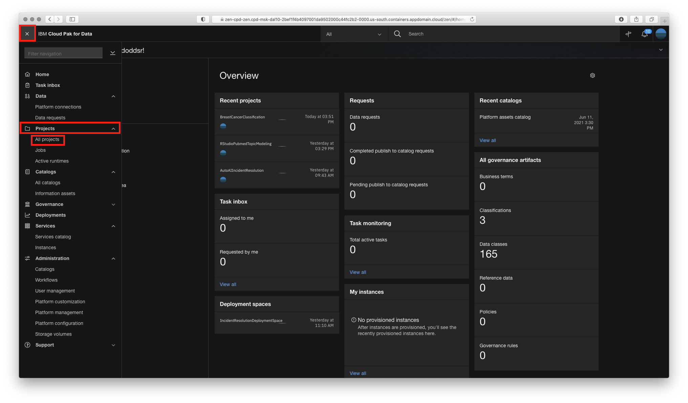

# Using Watson Discovery API

1. Go the (☰) navigation menu, expand `Projects` and click on the `MSK Benefits Project` project pre-created for this section.

    

2. Click on the notebook name `1_WatsonDiscovery_Crawl_and_Clean` to open it.

    

3. Please switch to the notebook execution mode.

    

    Here is the outcome: the notebook should show the menus related to executing cells:

    

4. Collect the required API configuration points according to the instructions in the notebook and run the notebook step-by-step.

    